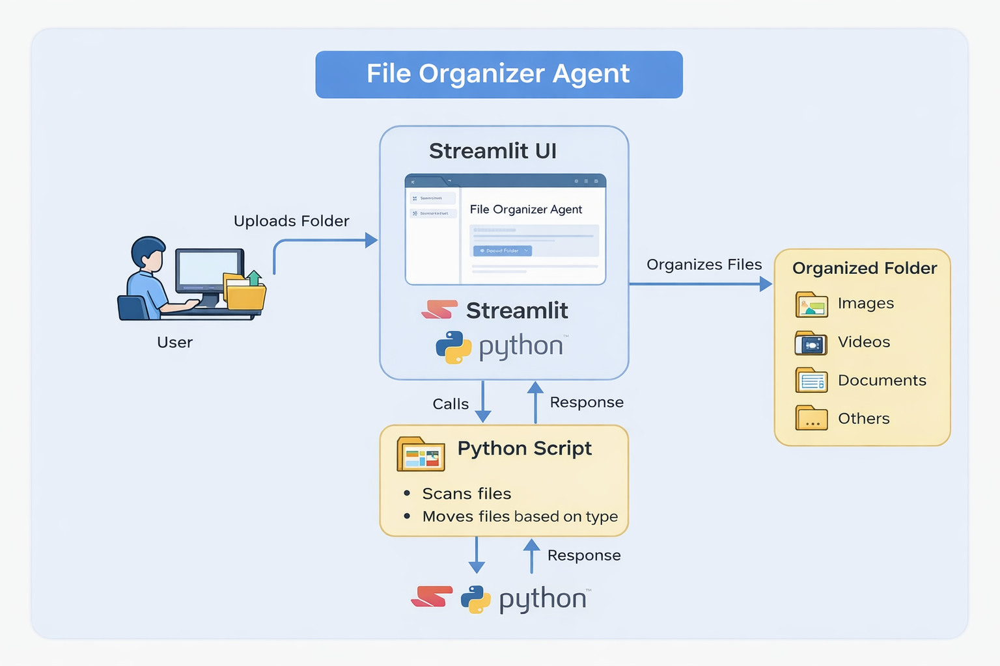
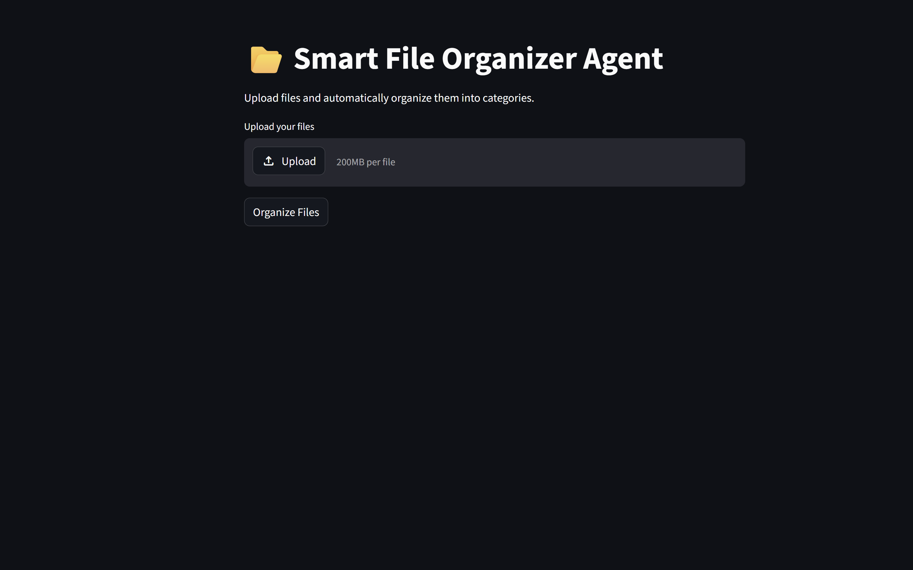
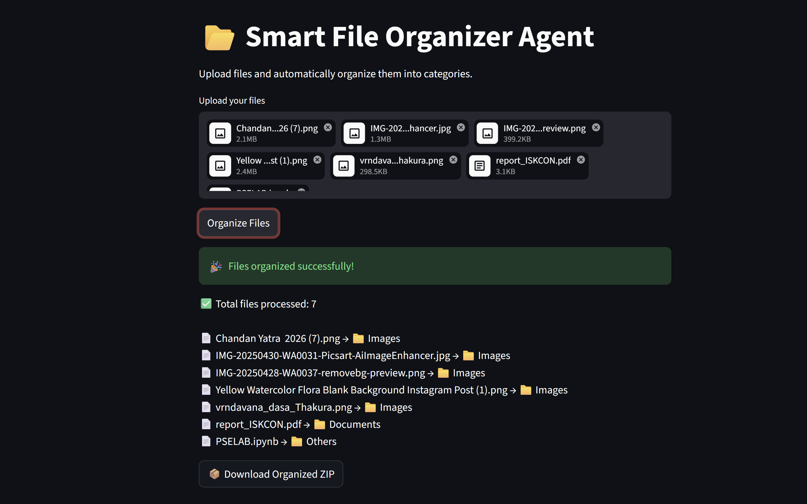

# File Organizer Agent

1. Business Problem:  
People have messy folders with many files mixed together. It is hard to find files quickly.

2. Possible Solution: 
We can manually organize files or build a program that automatically sorts files based on type.

3. Implemented Solution:
I created a Python-based file organizer that scans a folder and moves files into categories like Images, Videos, Documents, etc.

4. Tech Stack Used:
-> Language: Python  
-> Framework: Streamlit  
-> Libraries: os, shutil  

5. Architecture Diagram:  

6. How to Run Locally:
git clone <https://github.com/dhanu-07-Ram/file-organizer-agent.git>
cd file-organizer-agent
pip install -r requirements.txt
streamlit run app.py

7. References and Resources Used:
-> Python Official Documentation – https://docs.python.org/3/
-> Streamlit Documentation – https://docs.streamlit.io/
-> OS Module (File Handling) – https://docs.python.org/3/library/os.html
-> Shutil Module (File Operations) – https://docs.python.org/3/library/shutil.html
-> YouTube Tutorials on Python File Handling
-> ChatGPT (for guidance and debugging)

8. Recording:
[Watch Demo Video](https://youtu.be/wQkU3_5imd0)

9. Screenshots:
### 🔹 User Interface

### 🔹 Output

10. Problems Faced & Solutions

- Problem: Folder upload was not working properly in Streamlit  
  Solution: Fixed the file path handling and ensured correct folder selection.

- Problem: Files were not moving to correct folders  
  Solution: Corrected file extension checking logic in the Python script.

- Problem: Port already in use error while running Streamlit  
  Solution: Changed the port using --server.port option.

- Problem: Some files were not categorized correctly  
  Solution: Added proper conditions for different file types.

- Problem: Images were not displaying in README  
  Solution: Fixed file path and ensured images are pushed to GitHub repository.

- Problem: Managing project structure was confusing initially  
  Solution: Organized files into proper folders like images and screenshots.

